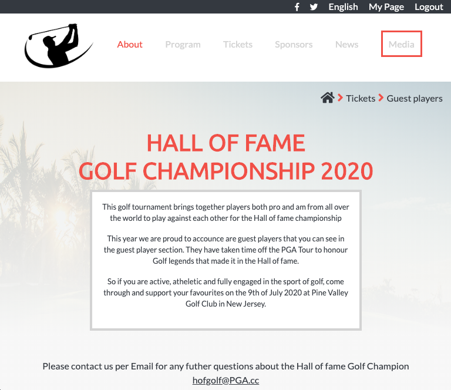
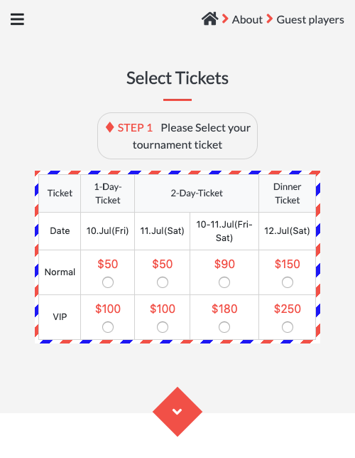

# HTML & CSS Captone Project Tournament Website
> Project is based on an online website for an imaginative golf tournament

**Desktop**

**Tablet**

**Mobile**

## Built With
- Box Model
- FlexBox
- Media Queries
- Bootstrap 4

## Presentation
Click [here](https://www.loom.com/share/53ea23bc856243d495ea06e3cbd06175) for presentation video

## Live Demo

[Live Demo Link](https://rawcdn.githack.com/Elbie-em/HTML-CSS-Captone-Project-Tournament-Website/3846c4891a53a7c014c0205ecab63e67c55727d2/index.html)

## Getting Started

**This is a static page and was made using CSS & HTML, you don't need anything complex to start up this page.It is already published in a public repository so you can check the final result by clicking on the live demo. You could also clone the repo can open the index.html file in any browser and traverse through the website to see the construct in action. For a better understanding of the code read about Box model, FlexBox,Grid, Media Queries and Floats and basic Bootstrap.**

## Author

👤 **Elbie Moonga**

- GitHub: [@Elbie-Em](https://github.com/Elbie-em)
- Twitter: [ElbieEm](https://twitter.com/ElbieEm)
- LinkedIn: [elbie-moonga](https://www.linkedin.com/in/elbie-moonga-253bbb12b/)

## 🤝 Contributing

Contributions, issues and feature requests are welcome!

## Show your support

Give a ⭐️ if you like this project!

## Acknowledgments

You can access all the design info (layouts) [here](https://www.behance.net/gallery/29845175/CC-Global-Summit-2015).

Design by [Cindy Shin](https://www.behance.net/adagio07)

## 📝 License

This project is [MIT](lic.url) licensed.

