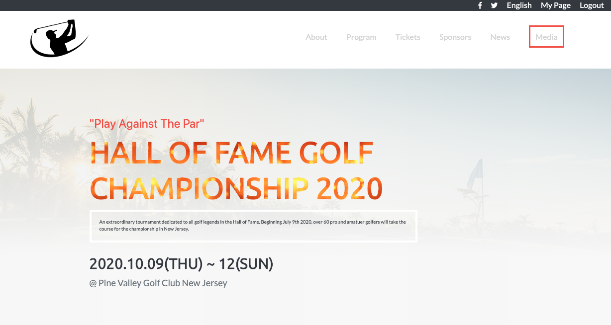

# HTML & CSS Captone Project Tournament Website
> Project is based on an online website for an imaginative golf tournament

**Desktop**

**Tablet**

**Mobile**

## Built With
- Box Model
- FlexBox
- Media Queries
- Bootstrap 4

## Presentation
Click [here](https://www.loom.com/share/53ea23bc856243d495ea06e3cbd06175) for presentation video

## Live Demo

[Live Demo Link](https://rawcdn.githack.com/Elbie-em/HTML-CSS-Captone-Project-Tournament-Website/dd77266ffd1ffa756ddfdd7051ebf7e863fd7c49/index.html)

## Getting Started

**This is a static page and was made using  CSS & HTML, you don't need .**
**anything to start up this page, is already published in a public repository so you can check the final result. For a better understanding of the code read about Bootstrap, <FlexBox,Grid, Media Queries and Floats.**

## Author

👤 **Elbie Moonga**

- GitHub: [@Elbie-Em](https://github.com/Elbie-em)
- Twitter: [ElbieEm](https://twitter.com/ElbieEm)
- LinkedIn: [elbie-moonga](https://www.linkedin.com/in/elbie-moonga-253bbb12b/)

## 🤝 Contributing

Contributions, issues and feature requests are welcome!

## Show your support

Give a ⭐️ if you like this project!

## 📝 License

This project is [MIT](lic.url) licensed.

